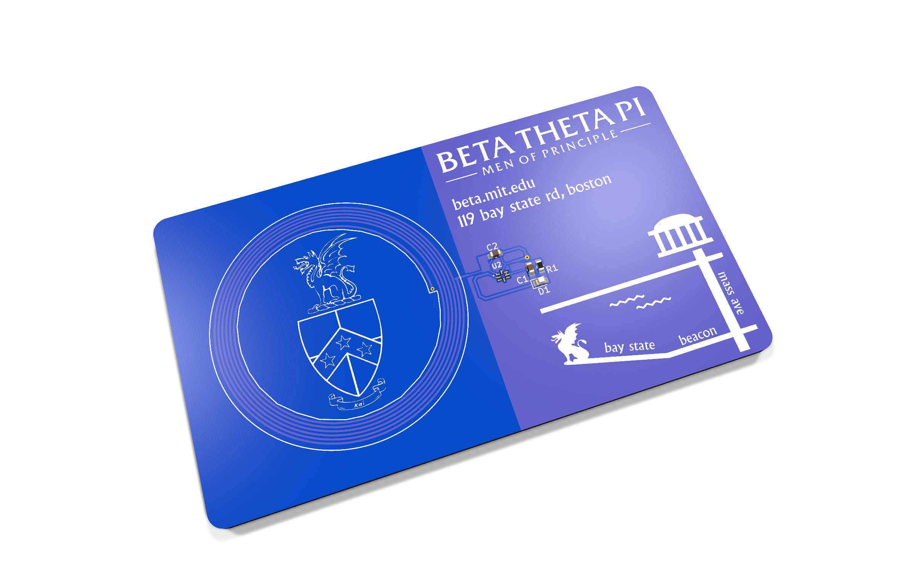
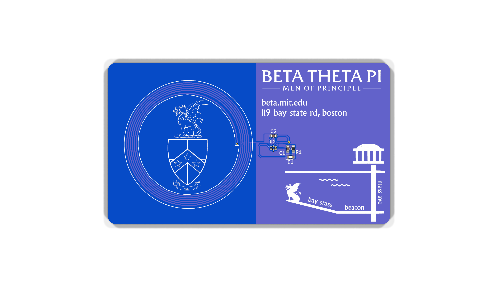
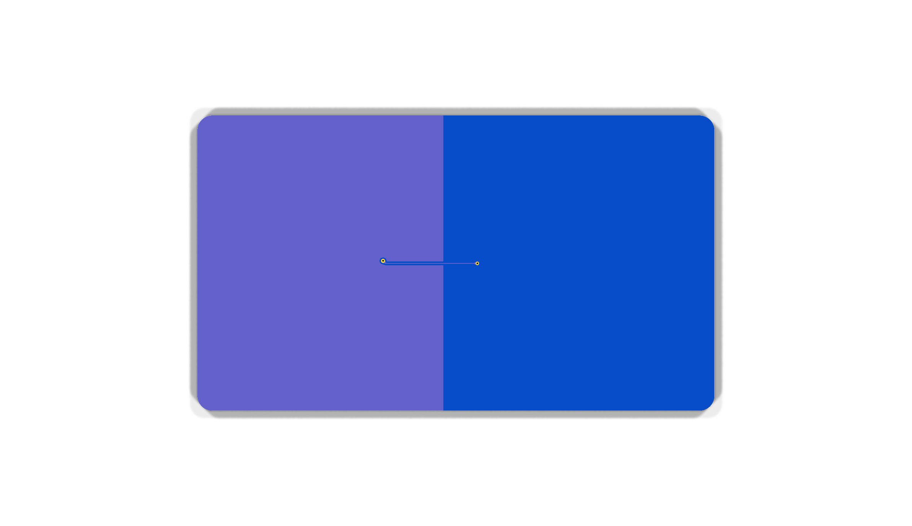

# Rush Cards — MIT Beta Theta Pi

<p align="center">
  
</p>

Two PCB cards designed for **Beta Theta Pi, Beta Eta chapter (MIT)** rush week,
**August 30 – September 6, 2025**. They are circuit boards, not cardstock — the
whole point was that handing someone a PCB is memorable in a way a paper flyer
never is.

**400 cards were made** by JLCPCB for **$109.80** in board cost: 50 assembled NFC
cards and 350 schedule cards. Everything needed to order more is in this repo,
including the exact files JLCPCB received.

| | |
|---|---|
| **Brother card** | A working NFC tag. A brother taps it to a phone and the phone opens the chapter's rush link. Carried by brothers during rush. **Blue, 1 mm, 50 made, assembled by JLCPCB.** |
| **PNM card** | A silkscreen-only board printing the full week's event schedule, the house address, and the van-pickup number. Handed to PNMs (prospective new members). **Green, 1 mm, 350 made.** |

Designed in **KiCad 9.0.2**. Both boards were fabricated and used.

> **Note for anyone reordering: both cards are 1 mm thick, and every KiCad file here
> says 1.6 mm.** Thickness is an order-page setting that isn't carried in the gerbers,
> so nothing will warn you. Same for the mask colours, which KiCad doesn't store at all.
> [`docs/order-history.md`](./docs/order-history.md) has the complete as-ordered spec.

---

## The boards

### Brother card — front and back

<p align="center">
  
</p>

The left half is a 6-turn spiral NFC antenna in copper, with the Beta crest and
dragon sitting inside the coil. The right half carries the wordmark, the house
address, the tiny NFC circuit (`U2`, `C1`, `C2`, `R1`, `D1`), and a stylized map
of the walk from campus to 119 Bay State Rd — MIT's dome, Mass Ave, the Charles,
Bay State, Beacon.

<p align="center">
  
</p>

The back is nearly empty by design: two pads and one short trace that carry the
inner end of the coil back out from under itself. **The two-tone split is not two
solder-mask colours** — it is bare copper zones used as artwork, so a single blue mask
reads as two shades. Never order "two-colour mask" for these.

### PNM card — front and back

<p align="center">
  
</p>
<p align="center">
  
</p>

Silkscreen only — no components, no nets, nothing to solder. Note the
**octagonal outline**: the corners are clipped on `Edge.Cuts`, which means the
fab has to rout the profile rather than just shear a rectangle.

---

## Repo map

```
.
├── brother-card/        ← the NFC card that was fabricated (v2, 2025-07-30)
├── brother-card-v1/     ← earlier iteration, NEVER fabricated (2025-07-06)
├── pnm-card/            ← the schedule card that was fabricated (2025-07-30)
├── lib/                 ← btp.pretty + btp.kicad_sym  (MUST stay next to the projects)
├── tools/
│   └── render-boards.sh ← regenerates docs/renders/ in the as-ordered mask colours
└── docs/
    ├── order-history.md       ← the 2025 JLCPCB order: spec, prices, parts, gotchas
    ├── reordering.md          ← how to get more cards made
    ├── next-year-checklist.md ← what to change to reuse these for a new rush
    ├── programming-the-tag.md ← how to write the rush link onto a card
    ├── kicad-setup.md         ← opening these files years from now
    ├── nfc-theory.md          ← upstream's full antenna derivation, credited
    ├── OPEN-QUESTIONS.md      ← what still isn't recorded anywhere
    ├── order-history/         ← JLCPCB order screenshots + production records
    ├── renders/               ← generated board renders (+ upstream's Blender model)
    ├── images/                ← upstream's figures, referenced by nfc-theory.md
    ├── antenna-simulations/   ← upstream's LTSpice + MATLAB work
    └── reference/             ← NXP AN11276, ST AN2972, antenna calculators
```

Each card directory holds its own `README.md` with the real detail, the KiCad
source, and a `fab/` folder containing the exact gerbers that were sent out —
**verified byte-identical to the files JLCPCB received.**

**Want to just order more cards?** You don't need KiCad at all. Go straight to
[`docs/reordering.md`](./docs/reordering.md), upload the `fab/…_release/` folders, and
set 1 mm thickness with the right mask colour.

## Opening these in KiCad

```sh
git clone <this repo>
cd RushCards
open brother-card/PCB_Business_Card.kicad_pro   # macOS; or File ▸ Open Project
```

Two things to know before you do, both covered in
[`docs/kicad-setup.md`](./docs/kicad-setup.md):

1. **Don't move `lib/`.** Each project's `fp-lib-table` resolves the artwork
   library as `${KIPRJMOD}/../lib/btp.pretty`. That relative hop is the only
   reason the boards open with their footprints intact — the original design
   depended on a library registered *globally* on one laptop, which would have
   made this repo useless to anyone else. Vendoring it was the single most
   important fix made when archiving.
2. These were built in **KiCad 9.0.2**. A newer KiCad will offer to migrate the
   file format. Let it, but **save to a branch**, and treat `fab/` as the
   authoritative record of what was actually manufactured — see
   [`docs/reordering.md`](./docs/reordering.md).

## Lineage

The brother card is a fork of
**[Raziz1/PCB_Business_Card](https://github.com/Raziz1/PCB_Business_Card)** by
**Rahim Aziz** (forked at commit `fe6c083`). That project's contribution is the
part that is genuinely hard: deriving the antenna geometry from the NFC IC's
50 pF parallel capacitance, simulating it in LTSpice and MATLAB, and confirming
resonance at 13.56 MHz on a real board with a network analyzer. **All of that was
inherited unchanged** and is preserved verbatim in
[`docs/nfc-theory.md`](./docs/nfc-theory.md).

What Beta added: all of the artwork, the Beta symbol/footprint library, a swap to
a smaller NFC IC package with a hand-drawn footprint, and the PNM card (which is
entirely original — it shares nothing with upstream but the toolchain).

## License

Beta's original work here — the artwork, the `btp` library, the board layouts, the
PNM card, and this documentation — is **MIT licensed**. See [`LICENSE`](./LICENSE).

Upstream's inherited material (`docs/nfc-theory.md`, `docs/images/`,
`docs/antenna-simulations/`) is **not** covered: upstream carries no license file, so
it's included with attribution while an explicit grant is sought. The Beta Theta Pi
crest and wordmark are the fraternity's marks and aren't licensed by this repo either.
`LICENSE` spells out each boundary; [`docs/OPEN-QUESTIONS.md`](./docs/OPEN-QUESTIONS.md)
§9 tracks the loose end.

## Reusing these next year

Start at [`docs/next-year-checklist.md`](./docs/next-year-checklist.md). The short
version: the PNM card needs its dates and events retyped every year and nothing else;
the brother card is year-independent, because the rush link is written to the chip
rather than printed on the board.

Three things worth knowing before you start:

- **The 2025 NFC tags were never locked**, so surviving brother cards can simply be
  rewritten — possibly no order needed at all.
- **Program the tags with a permanent redirect you control**, not a destination URL. The
  2025 cards point at a link that has already gone stale after a website change. A stable
  `beta.mit.edu/rush`-style path that redirects means future years change one line on the
  website and never touch hardware again. The chapter is moving to this;
  [`docs/programming-the-tag.md`](./docs/programming-the-tag.md) has the details.
- **The PNM card says "Saturday, August 31"**, but August 31, 2025 was a **Sunday**. The
  typo shipped on the physical cards. It's preserved in the source so the archive matches
  the artifact — fix it when you retype the dates.
