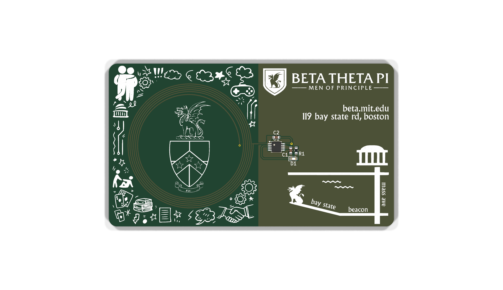

# Brother card v1 — earlier iteration, never fabricated

  

> **This board was not manufactured.** It is kept because it shows the design one
> step earlier, and because two of its choices are arguably better than the final
> card's. If you're looking for the card that actually existed, go to
> [`../brother-card/`](../brother-card/).

Last saved **2025-07-06**, about three and a half weeks before the final version.

## What changed between v1 and v2

| | v1 (this folder) | v2 (fabricated) |
|---|---|---|
| NFC IC | `NT3H1101W0FTTJ` — **TSSOP-8, 0.65 mm pitch** | `NT3H2111W0FHKH` — XQFN8, 1.6 × 1.6 mm, 0.5 mm pitch |
| IC footprint | `Package_SO:TSSOP-8_3x3mm_P0.65mm` (stock KiCad) | `btp:nfc-chip` (hand-drawn) |
| Left-half art | Doodle border (162 polygons) ringing the crest | Doodles removed; crest and coil given the space |
| Wordmark | `btp:btp-text-footprint-lg` — includes the shield | Plain `BETA THETA PI / MEN OF PRINCIPLE`, no shield |
| Coil | Smaller, set inside the doodle frame | Larger, fills the half |
| DRC | 21 violations, **1 unconnected item** | 19 violations, 0 unconnected |
| Fab output | none | `fab/2025-07-30_release/` |

The doodle border is the most visually distinctive thing this repo contains and it
did not survive to production — gamepads, gears, a card hand, books, a handshake,
the MIT dome, two figures. It's still in the vendored library as `btp:doodles`
(162 polygons) if a future year wants it back.

## Two reasons to look here before starting a v3

1. **TSSOP-8 is far easier to hand-assemble.** v2's XQFN8 is a 1.6 mm square with
   0.5 mm pitch and no exposed pad — genuinely hard to place by hand. v1's TSSOP-8
   has 0.65 mm pitch and gull-wing leads you can touch with an iron. Both parts are
   the same NTAG I²C family and pin-compatible for this circuit's purposes
   (`LA`/`LB` to the coil, `VCC` to the LED, I²C unused). **If a future year plans
   to hand-solder a large batch, start from this package choice.**
2. **The doodle art.** Reusing it is a copy-paste of `btp:doodles`, not a redraw.

## Caveats

- **It has 1 unconnected item.** This is an unfinished board. Don't send it to a fab
  without finishing the netlist.
- Its NFC symbol comes from `NT3H1101W0FTTJ:NT3H1101W0FTTJ`, a library that lived on
  upstream's Windows machine (`C:/Users/rahim/Downloads/...`) and does not exist
  anywhere in this repo. The symbol still **opens fine** because KiCad caches symbol
  definitions inside the `.kicad_sch` — but you can't update it from library, and
  Eeschema will flag the library as missing. Same for the bare `COIL_GENERATOR`
  footprint link.
- The antenna and matching network are identical in principle to v2's; see
  [`../brother-card/README.md`](../brother-card/README.md) and
  [`../docs/nfc-theory.md`](../docs/nfc-theory.md).
- `fab/2025-07-06_export/` contains a gerber export from this iteration **plus a
  `BOM.csv` inherited from upstream that still lists upstream's parts**
  (`NT3H1101W0FTTJ` in `TSSOP-8`, `REF**` for the coil). It documents where the
  design was mid-stream. It is not a release.
