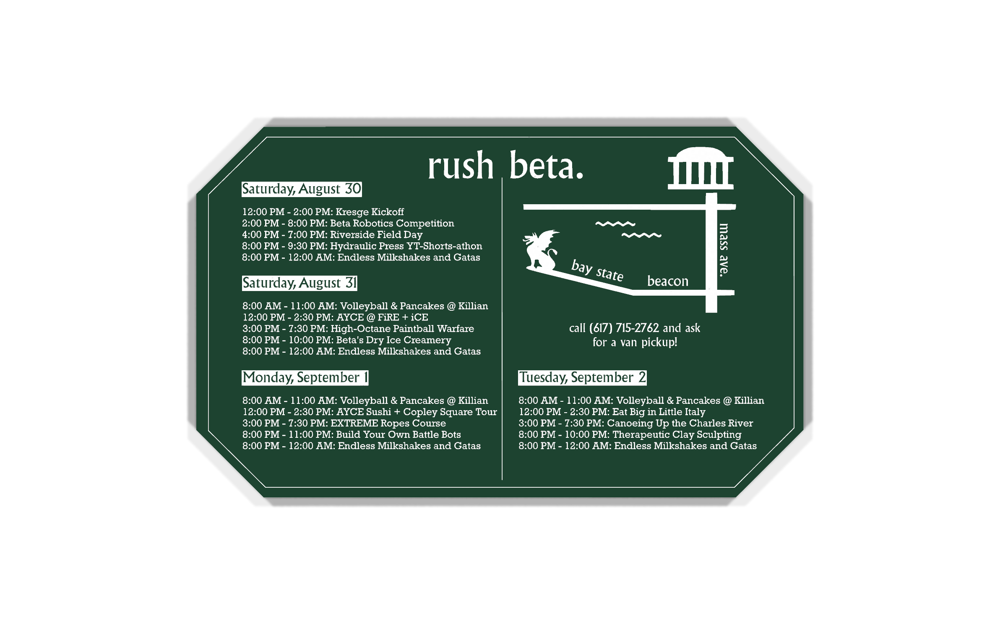
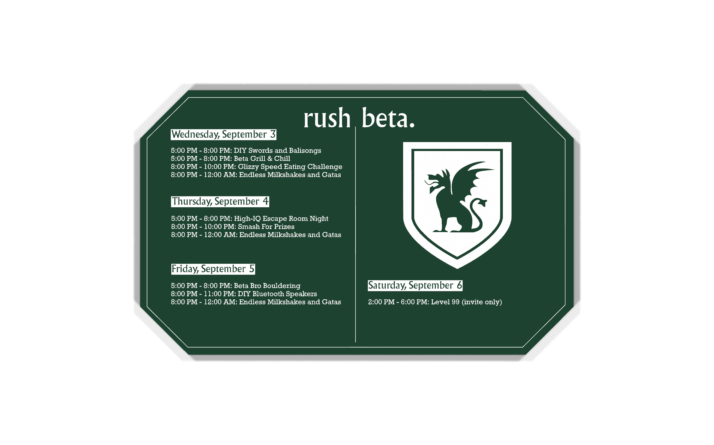

# PNM card — the rush schedule board

  

  

Handed to PNMs (prospective new members) during rush. It's a PCB purely as a
gimmick — there is **no circuit here at all**: no components, no nets, no copper
routing. The schematic is an empty sheet. Everything you see is silkscreen on a
bare two-layer board.

That makes this the easy card to reuse: nothing electrical can break, and the only
work each year is retyping the schedule.

| | |
|---|---|
| Source of record | `PNM_Rush_Card.kicad_pcb`, last saved **2025-07-30** |
| Designed in | KiCad **9.0.2** |
| Outline | **89.98 × 54.97 mm**, octagonal (clipped corners) |
| Stackup in the file | 2 layer FR4, 1.6 mm |
| **As actually ordered** | **1 mm thick, green mask, white silkscreen** — **350 pcs, $86.10** |
| Layers used | `F.SilkS` (28 items), `B.SilkS` (22), `Edge.Cuts` (8), one placeholder item each on `F.Cu` / `B.Cu` |
| Fab package | [`fab/2025-07-30_release/`](./fab/2025-07-30_release/) — byte-identical to what JLCPCB received |
| Order record | [`../docs/order-history.md`](../docs/order-history.md) |

> **The file says 1.6 mm; the cards are 1 mm.** Thickness is an order-page setting that
> isn't carried in the gerbers, so nothing reconciles it automatically. Set 1 mm explicitly
> on a reorder or you'll get noticeably chunkier cards.

## The outline is the one thing that costs money

The corners are **chamfered** — `Edge.Cuts` is an octagon, not a rectangle. A
rectangular card can be sheared or V-scored cheaply; this profile has to be
**routed**. When quoting, make sure the vendor is pricing a routed outline and
isn't silently substituting a rectangle. This is the single most likely way a
reorder comes back looking wrong.

JLCPCB got this right in 2025: its production file set for this card contains **no V-cut
layer at all** (and no drill file, since there are no holes), confirming the profile was
routed as intended. The brother card's set, by contrast, does have a V-cut layer — for the
assembly edge rails.

## What's printed on it

**Front** — `rush beta.`, the Back Bay map (MIT dome, Mass Ave, Charles, Bay
State, Beacon), `call (617) 715-2762 and ask for a van pickup!`, and the first
four days:

| Day | Events |
|---|---|
| **Saturday, August 30** | Kresge Kickoff · Beta Robotics Competition · Riverside Field Day · Hydraulic Press YT-Shorts-athon · Endless Milkshakes and Gatas |
| **"Saturday, August 31"** ⚠️ | Volleyball & Pancakes @ Killian · AYCE @ FiRE + iCE · High-Octane Paintball Warfare · Beta's Dry Ice Creamery · Endless Milkshakes and Gatas |
| **Monday, September 1** | Volleyball & Pancakes @ Killian · AYCE Sushi + Copley Square Tour · EXTREME Ropes Course · Build Your Own Battle Bots · Endless Milkshakes and Gatas |
| **Tuesday, September 2** | Volleyball & Pancakes @ Killian · Eat Big in Little Italy · Canoeing Up the Charles River · Therapeutic Clay Sculpting · Endless Milkshakes and Gatas |

**Back** — `rush beta.`, the crest, and the rest of the week:

| Day | Events |
|---|---|
| **Wednesday, September 3** | DIY Swords and Balisongs · Beta Grill & Chill · Glizzy Speed Eating Challenge · Endless Milkshakes and Gatas |
| **Thursday, September 4** | High-IQ Escape Room Night · Smash For Prizes · Endless Milkshakes and Gatas |
| **Friday, September 5** | Beta Bro Bouldering · DIY Bluetooth Speakers · Endless Milkshakes and Gatas |
| **Saturday, September 6** | Level 99 (invite only) |

> ⚠️ **A typo shipped on the physical cards.** The second block reads
> **"Saturday, August 31"**, but August 31, 2025 was a **Sunday**. Every other day
> label is correct. It is left uncorrected in the source so this archive matches the
> object that was actually handed out — fix it when you retype the dates for a new
> year.

## Artwork

Same technique as the brother card: art is polygons inside footprints, generated
with KiCad's *Bitmap to Component* converter. This board places `btp:map` (from the
vendored [`../lib/`](../lib/)) and one wordmark/crest footprint whose library link
is the stale bare name `LOGO` — it lives inside the `.kicad_pcb` and plots
correctly, but can't be *updated from library*. Don't delete it casually.

Event text is ordinary KiCad text objects with embedded `\n` line breaks, which is
what makes this card straightforward to retype — see
[`../docs/next-year-checklist.md`](../docs/next-year-checklist.md).

## Known DRC findings — all expected

KiCad 10 reports **21 violations, all `text_thickness`**, and nothing else: no
clearance errors, no unconnected items, no parity errors. The warnings say the
silkscreen stroke width is below the 0.15 mm design rule. The fab printed them
legibly anyway, as the renders show.

If you shrink the text further to fit more events, that warning is the thing to
actually pay attention to — at some point thin silkscreen stops resolving and
becomes unreadable. Keep an eye on the smallest strokes and ask the vendor for
their real minimum line width.

## Fab package

[`fab/2025-07-30_release/`](./fab/2025-07-30_release/) holds the gerbers that were
sent out: `F.Cu`, `B.Cu`, both silkscreens, both masks, both pastes, `Edge.Cuts`,
and two drill files (both empty — there is nothing to drill). Plotted from
KiCad 9.0.2; the job file reports `90.03 × 55.02 mm`.

**These have been byte-compared against the files JLCPCB actually received** and are
identical, so reordering from this folder reproduces the 2025 cards exactly.

One aesthetic note: the order specified **Mark on PCB: Order Number**, and unlike the
brother card this one has no edge rails for JLCPCB to hide that marking on. **There is
probably a small JLCPCB order number printed somewhere on a face of the delivered cards.**
If that matters, pick "Remove order number" or specify a location next time.

The silkscreen gerbers are large (1.1 MB front, 658 KB back) because all that text
and artwork is flattened to polygons. That's normal, not corruption.
